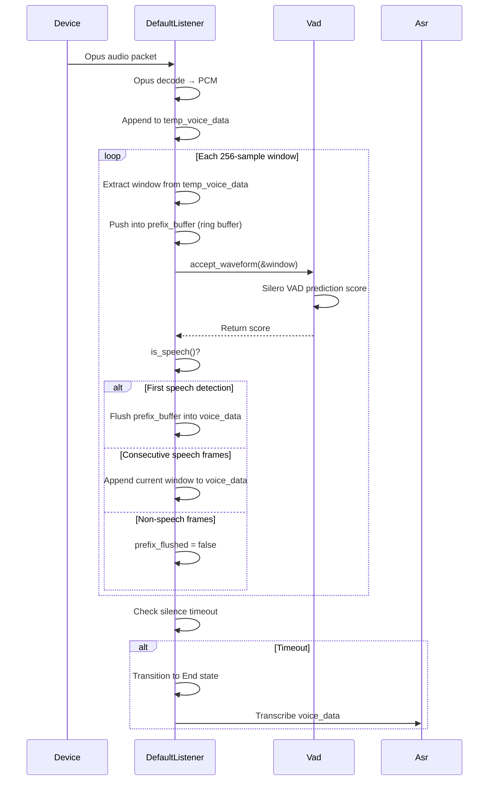

+++
title = "VAD and Listener"
weight = 400
[extra]
source_hash = "970b4ecbfeeba26d399924658e0e189c517479fb"
translated_at = "2026-06-28T18:00:00Z"
+++

# VAD and Listener

## Architecture Overview

Voice Activity Detection (VAD) and the audio Listener are the starting points of the voice interaction pipeline. They have clear separation of concerns:

- **VAD**: A pure decision engine — it only answers "does the current frame contain speech?" without managing any audio buffer
- **Listener**: An audio pipeline manager responsible for Opus decoding, VAD window cycling, audio accumulation, and state management

The VAD module lives at `apps/server/api/src/vad/` (Vad trait + VadFactory + model/), the Listener at `apps/server/api/src/ws/session/listener.rs`, and session recording at `apps/server/api/src/record/`.

### Processing Flow



## VAD Module

### Vad trait

Defined in `apps/server/api/src/vad/mod.rs`:

```rust
pub trait Vad: Send + Sync {
    /// Feed audio frame (window_size samples). Returns speech probability [0, 1].
    fn accept_waveform(&mut self, samples: &[f32]) -> Result<f32, ModelError>;
    /// Whether the state machine currently considers speech active.
    fn is_speech(&mut self) -> bool;
    /// Reset all internal state.
    fn clear(&mut self);
    /// Number of samples expected per frame.
    fn window_size(&self) -> usize;
}
```

| Method | Description |
|--------|-------------|
| `accept_waveform` | Feed one PCM frame, returns speech score [0, 1]; VAD maintains internal state machine |
| `is_speech` | Determine if currently in speech state based on internal state (score, silence duration, etc.) |
| `clear` | Reset VAD internal state, used after a conversation round ends |
| `window_size` | Expected input frame size (in samples) |

**Design principle**: VAD only makes decisions, it does not store audio samples. In the old design, VAD held `samples`, `front()`, `pop()` and other audio buffer methods internally; these were all removed in the new design, with audio accumulation unified under Listener.

### Model Implementations

| Model | Config Name | Window Size | Description |
|-------|-------------|-------------|-------------|
| **VadEarshot** | `earshot` | 256 samples (16ms) | Based on Silero VAD, weights embedded in binary, no external dependencies |
| **VadVoid** | `void` | 512 samples | Always returns `is_speech() = true`, for testing |

#### VadEarshot

Uses the [earshot](https://crates.io/crates/earshot) library under the hood, with Silero VAD model weights embedded via `include_bytes!`. All ML feature computation is done in pure Rust, no ONNX runtime required.

Noise gate logic:

```rust
// Transition from non-speech to speech requires 5 consecutive frames with score >= threshold
if !self.is_speech {
    if score >= threshold {
        self.prediction_list.push(score);
    } else {
        self.clear();              // Reset if any frame falls below threshold
    }
    if self.prediction_list.len() >= 5 {
        self.is_speech = true;
    }
}

// Accumulate silence duration during speech state; switch back to non-speech after min_silence_duration
if score >= threshold {
    self.current_silence_duration = 0.0;
} else {
    self.current_silence_duration += frame_duration_ms;
    if self.current_silence_duration > self.min_silence_duration {
        self.clear();
    }
}
```

#### VadVoid

Always returns `is_speech() = true`, `accept_waveform` returns score 1.0. Used in integration tests to skip VAD decision-making and directly verify the Listener and ASR pipeline.

### Configuration

```rust
#[derive(Debug, Deserialize, Clone)]
pub struct VadConfig {
    pub model: Option<VadModel>,            // earshot / void
    pub variant: Option<String>,
    pub path: Option<String>,
    pub num_threads: Option<i32>,
    pub threshold: Option<f32>,             // Speech threshold, default 0.5
    pub min_silence_duration: Option<f32>,  // Silence timeout (ms), default 1000
}
```

```toml
# application.toml (injected automatically by flake environment variables)
vad_model = "earshot"
vad_threshold = 0.5
vad_min_silence_duration = 1000.0
```

| Field | Default | Description |
|-------|---------|-------------|
| `threshold` | `0.5` | VAD speech threshold; lower is more sensitive |
| `min_silence_duration` | `1000` | Speech end detection: consecutive silence exceeding this value (ms) marks speech as finished |

### Factory Pattern

```rust
// Initialization (called once at application startup)
VadFactory::init(config).await;

// Usage (create_model is a static method, no global() needed)
let vad = VadFactory::create_model(&VadConfig { ... });  // Box<dyn Vad>
vad.accept_waveform(&samples)?;
```

## Listener Module

### Listener trait

Defined in `apps/server/api/src/ws/session/listener.rs`:

```rust
#[async_trait]
pub trait Listener: Send + Sync {
    async fn accept(&mut self, input: ListenInput);                          // Process Opus packet or text
    fn set_state(&mut self, state: ListenState);
    fn get_state(&self) -> ListenState;
    async fn reset(&mut self, silence_voice_timeout: Option<i64>);
    async fn set_sender(&mut self, tx: UnboundedSender<OutputMessage>);
    async fn take_voice(&mut self) -> Vec<f32>;                              // Extract voice data (without triggering ASR)
    async fn take_result(&mut self) -> (Vec<f32>, Result<ListenResult, ModelError>); // ASR transcription
    fn clone_asr(&self) -> Option<Arc<Mutex<Box<dyn Asr>>>>;
    async fn get_raw_pcm(&mut self) -> Vec<f32>;                             // Debug/testing use
}
```

### State Machine

```
Idle ──(first listen())──▶ Listening(false)
                             │
                   (VAD detects speech)
                             ▼
                        Listening(true)
                             │
                   (silence timeout reached)
                             ▼
                           End
                             │
                       (reset())
                             ▼
                           Idle
```

| State | Description |
|-------|-------------|
| `Idle` | Initial state, waiting for first audio frame |
| `Listening(false)` | Receiving audio, VAD has not yet confirmed speech |
| `Listening(true)` | Receiving audio, speech has been detected |
| `End` | Silence timeout reached, session ended, ready for transcription |

### DefaultListener

#### Data Structures

```rust
pub struct DefaultListener {
    temp_voice_data: Vec<f32>,                // PCM staging area after Opus decoding
    voice_data: Vec<f32>,                     // Accumulated speech PCM (finally sent to ASR)
    vad: Box<dyn Vad>,
    asr: Arc<Mutex<Box<dyn Asr>>>,
    decoder: StdMutex<opus::Decoder>,
    pub state: ListenState,
    silence_voice_timeout: Option<i64>,       // in ms
    latest_speaking_time: Option<i64>,
    audio_config: Arc<AudioConfig>,
    error_tx: Option<UnboundedSender<OutputMessage>>,

    // Prefix buffer (300ms ring buffer)
    prefix_buffer: Vec<f32>,                  // Max 4800 samples
    prefix_flushed: bool,                     // Whether flushed in current round
    total_pcm: Vec<f32>,                      // Debug cumulative PCM
    pending_text: Option<String>,             // Text input staging
}
```

#### accept() Loop

```
ListenInput
  │
  ├── Text(text) → pending_text = Some(text)
  │
  └── Audio(opus_packet)
        │
        ▼
      OpusDecoder.decode_float() → PCM f32
        │
        ▼
       Append to temp_voice_data
        │
        ▼
      while temp_voice_data.len() > window_size:
        │
        ├─ drain window_size samples → window
        ├─ prefix_buffer.extend(&window)
        ├─ trim prefix_buffer to ≤4800
        ├─ VAD.accept_waveform(&window)  (sync)
        │
        └─ if VAD.is_speech():
        │      state = Listening(true)
        │      if !prefix_flushed:
        │          voice_data += prefix_buffer (300ms prefix)
        │          prefix_flushed = true
        │          prefix_buffer = Vec::new()
        │      else:
        │          voice_data += window (current frame only)
        │   else:
        │      prefix_flushed = false
        │
        ▼
       Check silence timeout
```

#### Prefix Buffer Design

**Purpose**: VAD cannot detect speech onset with zero latency. When VAD reports `is_speech = true`, the speaker has already been vocalizing for ~5-16 frames (80-256ms). Without a prefix buffer, voice_data would lose the beginning of speech.

**Implementation**:

- Size: `PREFIX_SAMPLES_MAX = 4800` (300ms × 16000Hz)
- Mechanism: each VAD window is appended to `prefix_buffer`; excess is trimmed from the head (ring buffer)
- On first `is_speech()`, the entire `prefix_buffer` is moved to `voice_data` as a prefix
- Subsequent consecutive speech frames only append the current window, without re-flushing the prefix
- Non-speech frames reset `prefix_flushed = false`, ensuring a fresh prefix for the next speech round
- `reset()` clears both the prefix buffer and the flag

#### Silence Timeout

```rust
if let (Some(timeout), Some(last_speech)) = (self.silence_voice_timeout, self.latest_speaking_time) {
    let elapsed = Local::now().timestamp_millis() - last_speech;
    if elapsed >= timeout {
        self.state = ListenState::End;
    }
}
```

- `latest_speaking_time` is updated on every `is_speech()` frame
- When silence timeout is reached, state transitions to `End`, and Session calls `take_result()` to trigger ASR transcription

## Testing Strategy

### VAD Layer Tests

`tests/vad_test.rs` — functional verification:

- Speech → silence → speech: three round state transitions
- Verify `is_speech()` correctly follows audio content changes

`tests/vad_analysis_test.rs` — accuracy evaluation (`#[ignore]`, requires TEN-vad test set):

```
=== Summary (threshold=0.5) ===
frames   correct  TP       FP       TN       FN       Precision    Recall       F1
4418     3815     3218     508      597      95       0.8637       0.9713       0.9143
```

| Threshold | Precision | Recall | F1 |
|-----------|-----------|--------|----|
| 0.50 | 0.864 | **0.971** | 0.914 |
| 0.70 | **0.930** | 0.925 | **0.928** |

Current default threshold `0.50` favors recall (reducing missed speech cuts), suitable for the "don't cut off speech" production requirement.

### Listener Layer Tests

`tests/listener_test.rs` — 5 white-box tests:

| Test | Scenario |
|------|----------|
| `test_prefix_included_in_first_speech` | Silence 2s → speech, verify voice_data ≥ 4800 |
| `test_voice_data_grows_monotonically` | Two rounds of continuous speech, data only grows |
| `test_prefix_fresh_after_silence` | Prefix re-filled after 3s silence between rounds |
| `test_reset_clears_everything` | After Reset, voice_data is empty; re-filling has new prefix |
| `test_silence_only_no_end_state` | Pure silence with no timeout, never enters End |

### Integration Tests

`tests/session/` — full pipeline integration tests (`#[ignore]`, requires real model files):
- `test_chat_flow_hello`: Void VAD + Void ASR + Echo LLM + Mute TTS
- `test_chat_flow_listen_manual`: Opus encode/decode + VAD + Void ASR
