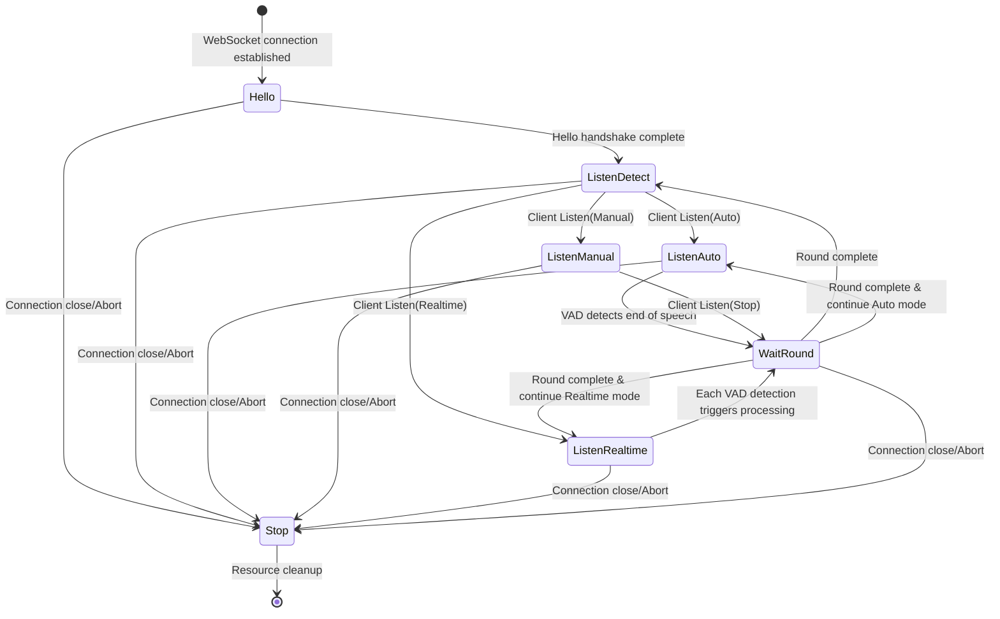
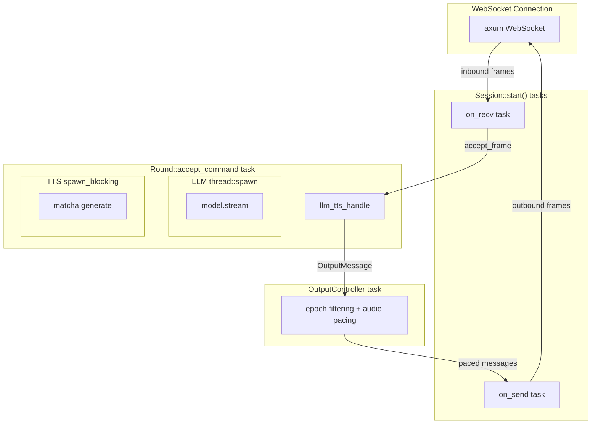
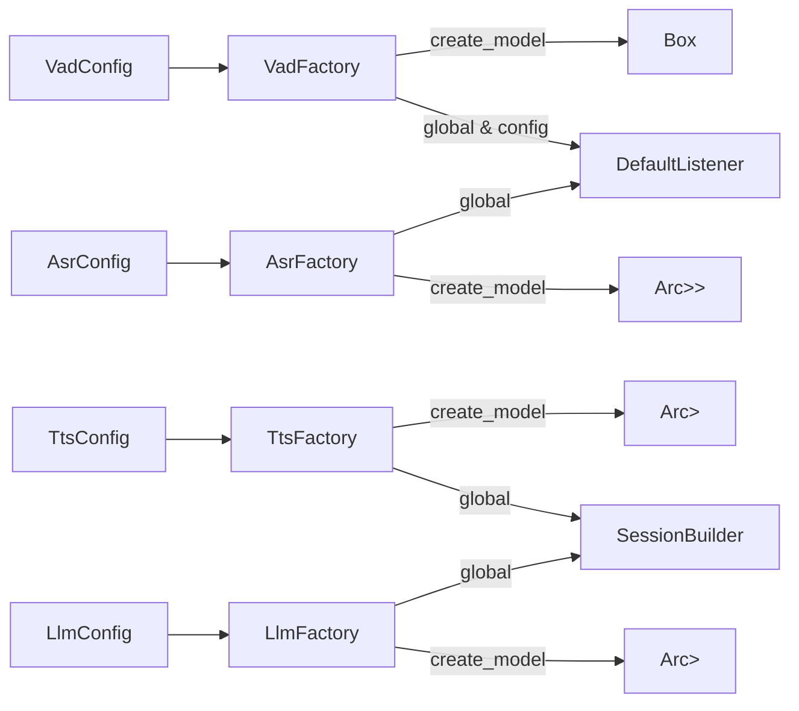

+++
title = "Core Architecture"
weight = 200
[extra]
source_hash = "0000000000000000000000000000000000000000"
translated_at = "2026-06-28T18:00:00Z"
+++

# Core Architecture

## Session Lifecycle

### State Machine (Phase)

The Session manages the connection lifecycle through the `Phase` enum:



### Three Listen Modes

| Mode | Trigger | End Condition | Use Case |
|------|---------|---------------|----------|
| Auto | Client sends `Listen(Auto)` | VAD detects silence timeout | Voice-activated auto interaction |
| Manual | Client sends `Listen(Manual)` | Client sends `Listen(Stop)` | Push-to-talk |
| Realtime | Client sends `Listen(Realtime)` | Processed on each VAD detection | Real-time transcription |

### Core Structs

```
SessionBuilder (all dependencies injected at build)
  └── Session
       ├── id: String (XID)
       ├── phase: Phase (state machine)
       ├── output_epoch: AtomicU64 (Round incrementing counter)
       ├── cancel: CancellationToken (global cancel)
       ├── round: Option<Round> (current active Round)
       ├── listener: Box<dyn Listener> (VAD + ASR + audio buffer)
       ├── output_controller: OutputController (outbound flow control)
       └── observers: Vec<Arc<dyn SessionObserver>> (persistence callbacks)
```

## Concurrency Model



Key design decisions:
- `on_recv` and `on_send` use `tokio::spawn` (IO-intensive)
- LLM inference uses `thread::spawn` + `block_on` (CPU-intensive, does not block tokio runtime)
- TTS generation uses `tokio::task::spawn_blocking` (ONNX inference blocking)
- Rounds are isolated via `output_epoch`, old Round messages are automatically discarded
- OutputController is the sole throttling point, using `bounded(64)` channel for backpressure

## Factory Pattern

All AI components are managed via OnceLock global Factories:



Initialization order (in `api::start`):
1. `Jwt::init(auth_config)` — JWT
2. Database connection + migrations
3. `TtsFactory::init(tts_config, audio_config)`
4. `VadFactory::init(vad_config)`
5. `AsrFactory::init(asr_config)`
6. `LlmFactory::init(llm_config)`
7. HTTP server start (+ optional Matrix client)
