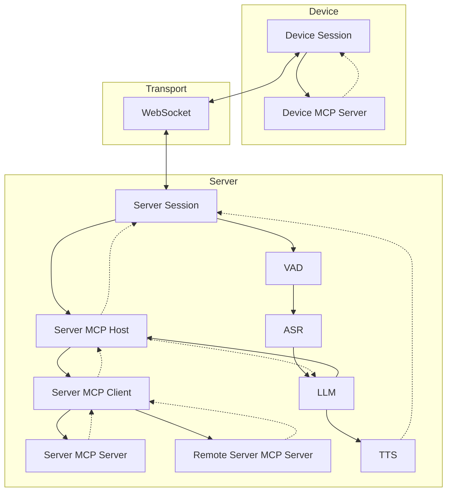
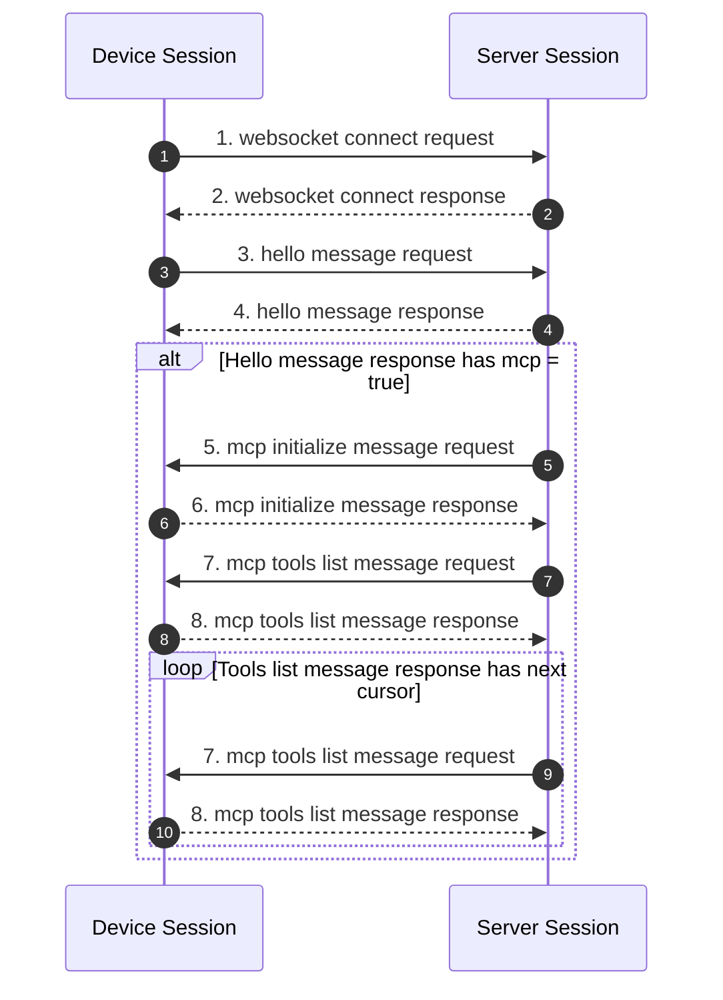
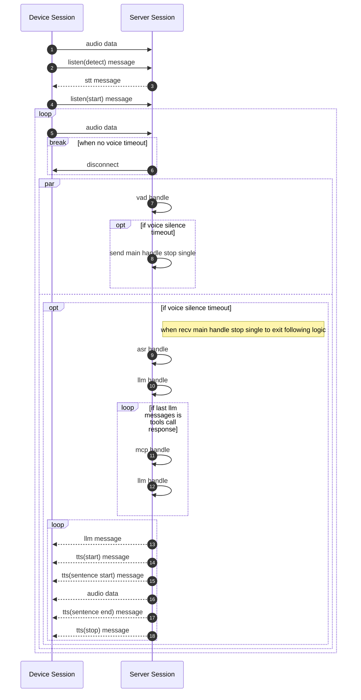
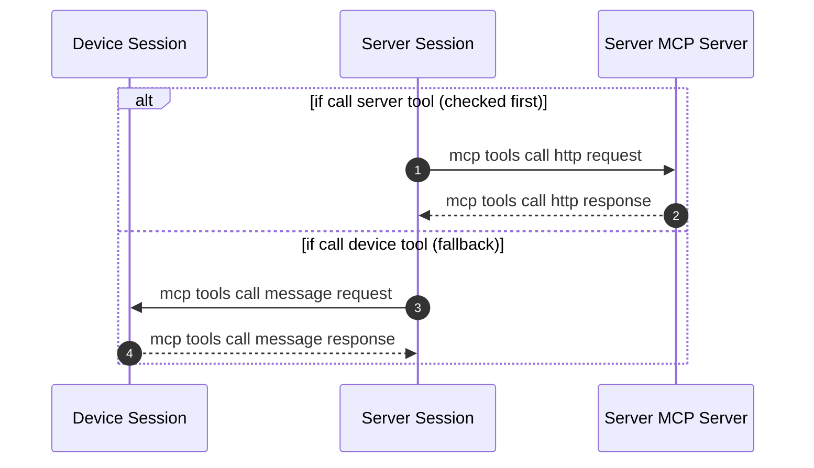

+++
title = "Dialogue Flow"
weight = 201
[extra]
source_hash = "970b4ecbfeeba26d399924658e0e189c517479fb"
translated_at = "2026-06-28T18:00:00Z"
+++

# Dialogue Flow

### Handshake Phase

### Communication Phase

### Listen Modes

The three modes are selected by the Session based on the `listen_mode` field in the Hello message, all using the same underlying VAD + Listener implementation. See [VAD & Listener](@/development/debugging/vad-listener.en.md) for details.

#### Auto

The device continuously sends audio → the server automatically detects the end of speech (silence timeout) → triggers ASR + LLM processing. Suitable for hands-free conversation scenarios.

#### Manual

The device independently controls the start and end of audio transmission; the server starts receiving on `listen(start)` and triggers processing on `stop` or silence timeout. Suitable for push-to-talk scenarios.

#### Realtime

Low-latency mode. VAD detection directly triggers audio streaming without waiting for silence timeout before starting LLM inference and TTS streaming output. Suitable for real-time devices like ESP32.

### MCP Handle

Detailed protocol field definitions can be found in [WebSocket Protocol](@/development/server/websocket-protocol.en.md).
