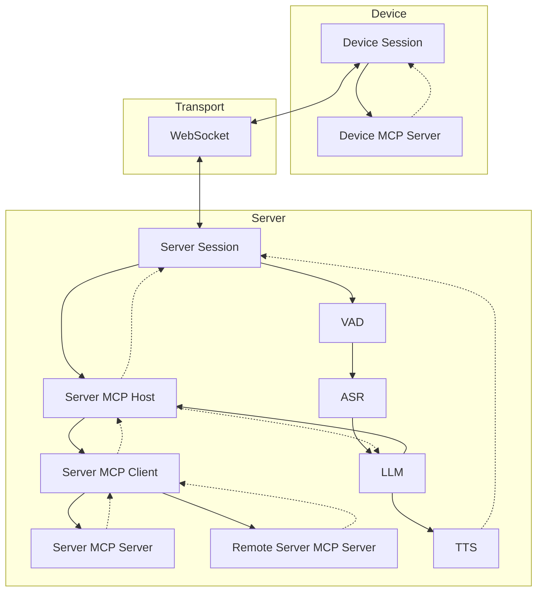
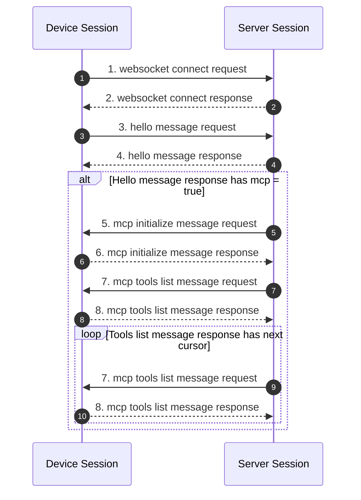
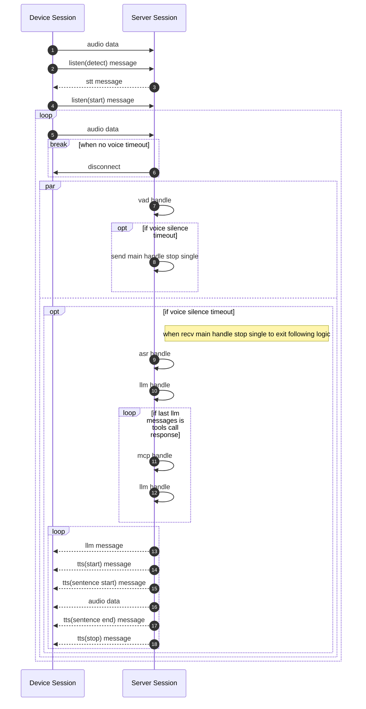
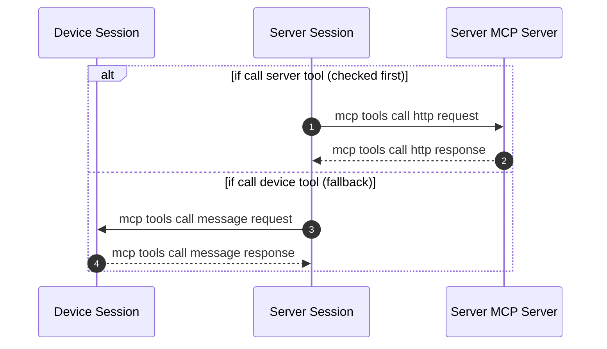

+++
title = "对话流程"
weight = 201
+++

# 对话流程

### 握手阶段

### 通讯阶段

### Listen mode

三种模式由 Session 根据 Hello 消息中的 `listen_mode` 字段选择，底层均使用同一套 VAD + Listener 实现。详见 [VAD & Listener](@/development/debugging/vad-listener.md)。

#### Auto

设备持续发送音频 → 服务器自动检测语音结束（静默超时）→ 触发 ASR + LLM 处理。适合免提对话场景。

#### Manual

设备独立控制语音发送的开始和结束，服务器收到 `listen(start)` 开始接收，收到 `stop` 或静默超时后触发处理。适合按键通话场景。

#### Realtime

低延迟模式，VAD 检测到语音后直接发送音频流，不等待静默超时即开始 LLM 推理和 TTS 流式输出。适合 ESP32 等实时设备。

### MCP handle

详细的协议字段定义见 [WebSocket Protocol](@/development/server/websocket-protocol.md)。
