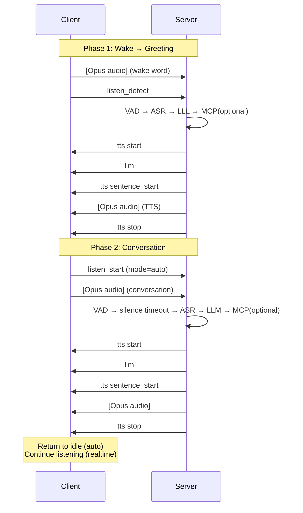
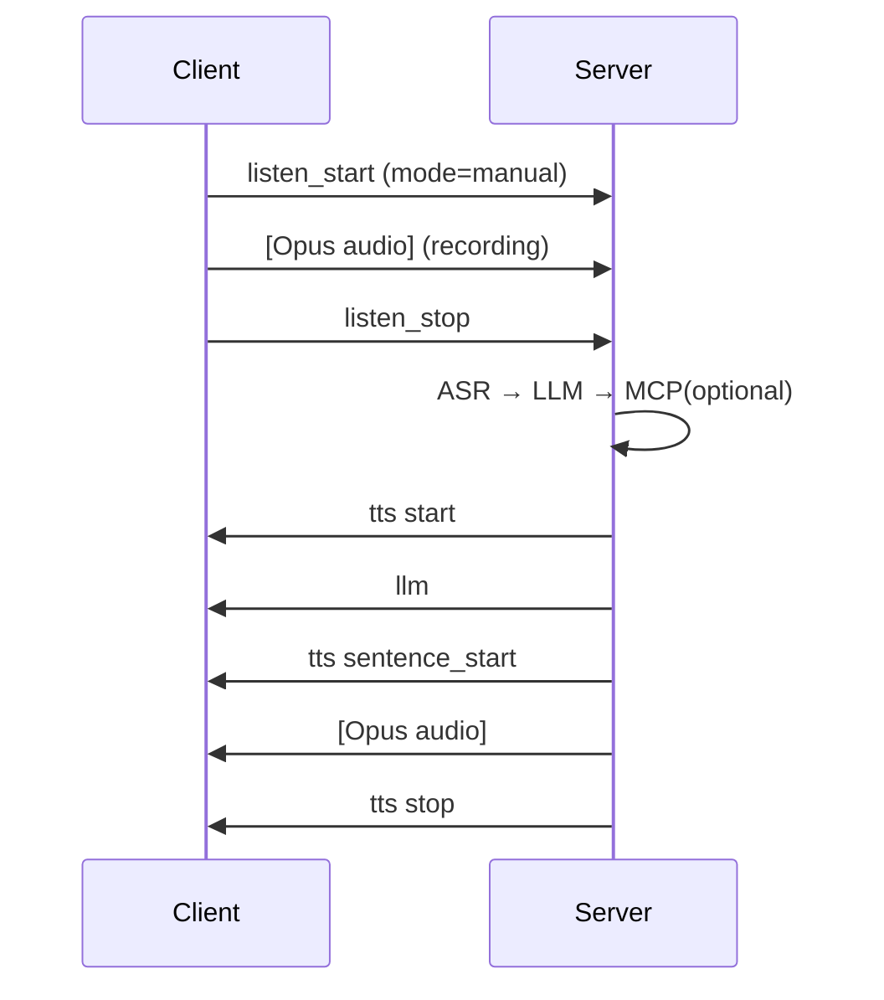
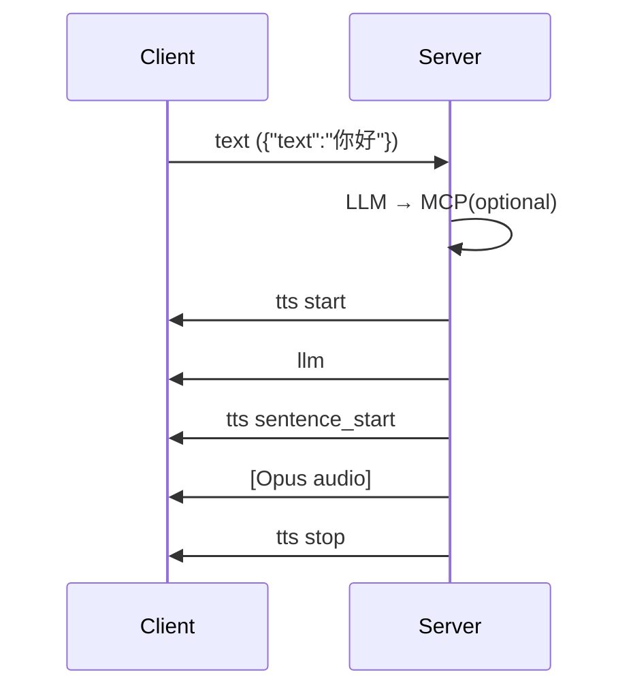
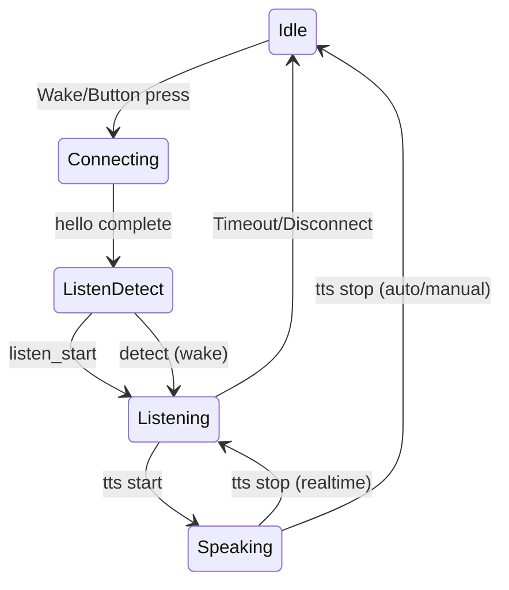

+++
title = "WebSocket Communication Protocol"
weight = 202
[extra]
source_hash = "970b4ecbfeeba26d399924658e0e189c517479fb"
translated_at = "2026-06-28T18:00:00Z"
+++

# WebSocket Communication Protocol

This protocol is compiled based on the actual implementation of [xiaozhi-esp32](https://github.com/78/xiaozhi-esp32) and the chobits server.

---

## 1. Protocol Overview

```
connect
  request
    hello
  response
    hello

listen
  Auto / Realtime
    request
      [audio]                                // wake word audio
      detect-text                            // {"text":"Hi XiaoZhi"}
      <vad>
        //asr
        //llm
          <mcp>
    response
      <tts>                                  // greeting

    request
      listen_start                           // {"mode":"auto"}
      [audio]                                // conversation audio
        <vad>
        //asr
        //llm
          <mcp>
    response
      <tts>                                  // auto: return to idle after playback
                                             // realtime: continue listening after playback

  Manual
    request
      listen_start                           // {"mode":"manual"}
      [audio]                                // recording
        //asr
        //llm
          <mcp>
      listen_stop
    response
      <tts>

  Text
    request
      text                                   // {"text":"你好"}
        //llm
          <mcp>
    response
      <tts>

abort                                        // interrupt TTS
  request
    abort

---

vad                                          // server internal
  vad pass
    //silent checking stop
    //to asr
  vad ignore
    abort

tts                                          // server → client
  response
    start
      llm                                    // {"emotion":"happy"}
      sentence_start
      [audio]
      sentence_end
    stop

mcp                                          // tools/call
  request
    tool_call
  response
    tool_result
```

---

## 2. Connection Establishment

### 2.1 WebSocket Headers

| Header | Required | Description |
|--------|----------|-------------|
| `Authorization` | No | `Bearer <token>` |
| `Protocol-Version` | Yes | Binary protocol version, currently `1` |
| `Device-Id` | Yes | MAC address |
| `Client-Id` | Yes | UUID v4 |

### 2.2 Hello

Client → Server:

```json
{
  "type": "hello",
  "version": 1,
  "transport": "websocket",
  "audio_params": {
    "format": "opus",
    "sample_rate": 16000,
    "channels": 1,
    "frame_duration": 60
  },
  "features": {
    "mcp": true,
    "aec": true
  }
}
```

Server → Client:

```json
{
  "type": "hello",
  "transport": "websocket",
  "session_id": "xxx",
  "audio_params": {
    "sample_rate": 24000,
    "frame_duration": 60
  }
}
```

`transport` is **required**; the client will disconnect if it is missing or does not match `"websocket"`. `session_id` is the session identifier, carried in all subsequent messages. `audio_params` are direction-independent: the client Hello specifies uplink parameters (device → server), and the server Hello specifies downlink parameters (server → device).

---

## 3. Session Sequence

### Auto Mode



### Manual Mode



### Text Mode



### State Machine



---

## Appendix A: Message Field Reference

A.1 Client → Server

```
type:hello
  version: int              Required
  transport: "websocket"    Required
  audio_params: {}
    format: "opus"
    sample_rate: 16000
    channels: 1
    frame_duration: 60      Unit: ms
  features: {}
    mcp: bool
    aec: bool

type:listen, state:detect
  session_id: string        Required
  text: string              Wake word text, e.g. "Hi XiaoZhi"

type:listen, state:start
  session_id: string        Required
  mode: "auto"|"manual"     Required

type:listen, state:stop
  session_id: string        Required

type:text
  session_id: string        Required
  text: string              Required, user input text

type:abort
  session_id: string        Required
  reason: string            Optional, "wake_word_detected"

type:mcp, payload.method:"initialize"
  payload: {}
    jsonrpc: "2.0"          Required
    method: "initialize"    Required
    params: {}
      capabilities: {}
    id: int                 Required, request identifier

type:mcp, payload.method:"tools/list"
  payload: {}
    jsonrpc: "2.0"          Required
    method: "tools/list"    Required
    params: {}
      cursor: string        Optional, pagination cursor
    id: int                 Required

type:mcp, payload.method:"tools/call"
  payload: {}
    jsonrpc: "2.0"          Required
    method: "tools/call"    Required
    params: {}
      name: string          Required, tool name
      arguments: {}         Optional, tool arguments
    id: int                 Required
```

A.2 Server → Client

```
type:hello
  transport: "websocket"    Required
  session_id: string        Required
  audio_params: {}
    sample_rate: int        Optional, default 24000
    frame_duration: int     Optional, default 60

type:stt
  session_id: string
  text: string              ASR recognition result

type:llm
  session_id: string
  emotion: string           "happy"|"sad"|"neutral"|...
  text: string              Emoji

type:tts, state:start
  session_id: string

type:tts, state:sentence_start
  session_id: string
  text: string              Current sentence text

type:tts, state:sentence_end
  session_id: string

type:tts, state:stop
  session_id: string

type:system
  command: "reboot"

type:mcp
  payload: {}
    jsonrpc: "2.0"
    id: int                 Corresponding request id
    result: {}              On success
    error: {}               On failure
      code: int
      message: string

type:mcp, response to "initialize"
  payload.result: {}
    protocolVersion: string
    capabilities: {}
    serverInfo: {}
      name: string
      version: string

type:mcp, response to "tools/list"
  payload.result: {}
    tools: []
      name: string
      description: string
      inputSchema: {}
    nextCursor: string       Optional

type:mcp, response to "tools/call"
  payload.result: {}        On success
    content: []
      type: "text"
      text: string
    isError: false
  payload.error: {}         On failure
    code: int
    message: string
```

---

## Appendix B: Binary Protocol

Opus-encoded audio is transmitted via WebSocket binary frames. The version number is declared by the `Protocol-Version` header.

### Version 1 (Default)

Raw Opus data, no header.

```
[Opus data]
```

### Version 2

16-byte header + Opus data (all multi-byte fields use network byte order).

```
struct BinaryProtocol2 {
    uint16_t version;        // Protocol version
    uint16_t type;           // 0=OPUS, 1=JSON
    uint32_t reserved;
    uint32_t timestamp;      // Timestamp (ms), used for server AEC
    uint32_t payload_size;
    uint8_t  payload[];
};
```

### Version 3

4-byte header + Opus data.

```
struct BinaryProtocol3 {
    uint8_t  type;           // 0=OPUS
    uint8_t  reserved;
    uint16_t payload_size;
    uint8_t  payload[];
};
```

---

## Appendix C: Changelog

| Date | Description |
|------|-------------|
| 2026-06 | Reorganized. Layered into overview/sequence/field reference. Added `type:text`, removed `realtime` standalone mode, `detect` used only for wake word |
