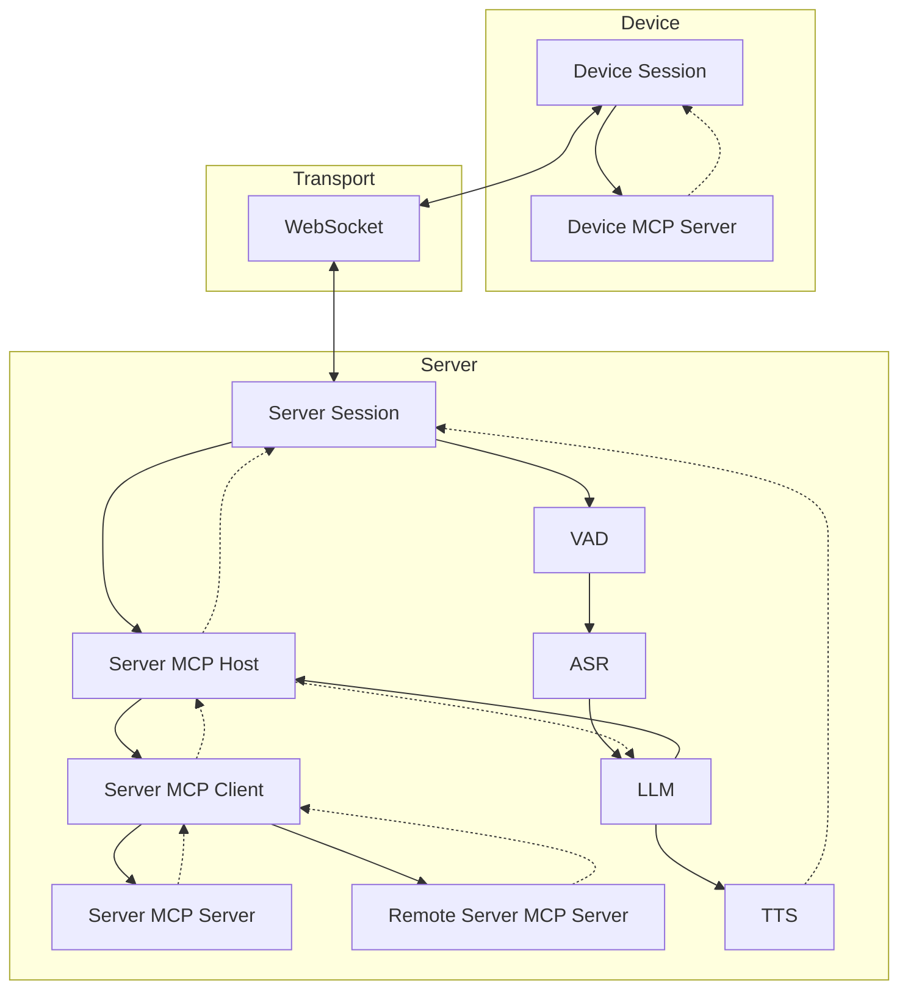
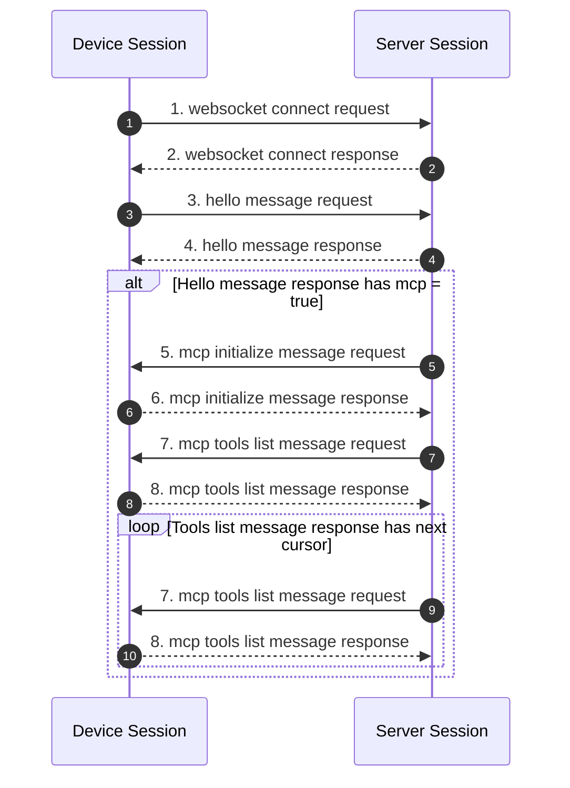
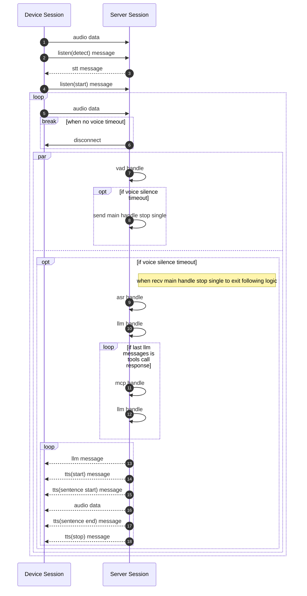
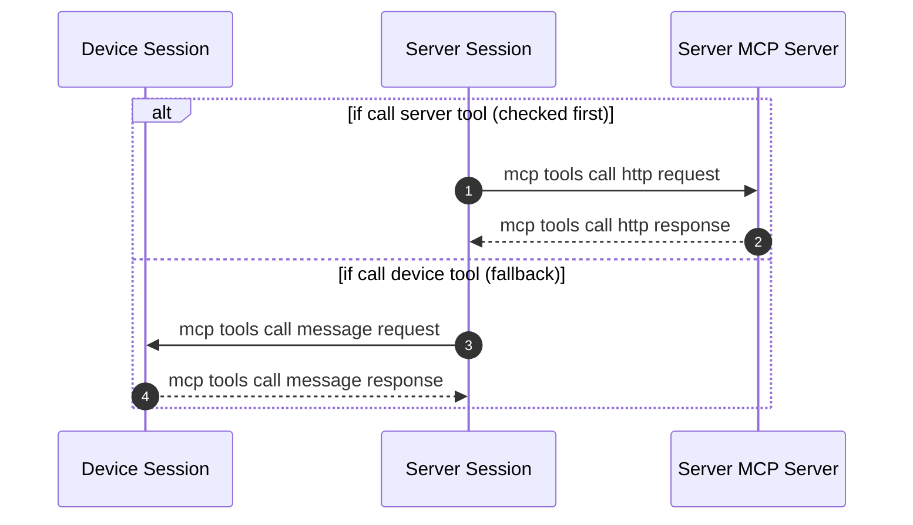

# Development

## File structure

整体项目结构见 [AGENTS.md](../../AGENTS.md) 目录树。各模块细节见对应开发文档。

## Chat Flow



### 握手阶段



### 通讯阶段



### Listen mode

三种模式由 Session 根据 Hello 消息中的 `listen_mode` 字段选择，底层均使用同一套 VAD + Listener 实现。详见 [VAD & Listener](./vad-listener.md)。

#### Auto

设备持续发送音频 → 服务器自动检测语音结束（静默超时）→ 触发 ASR + LLM 处理。适合免提对话场景。

#### Manual

设备独立控制语音发送的开始和结束，服务器收到 `listen(start)` 开始接收，收到 `stop` 或静默超时后触发处理。适合按键通话场景。

#### Realtime

低延迟模式，VAD 检测到语音后直接发送音频流，不等待静默超时即开始 LLM 推理和 TTS 流式输出。适合 ESP32 等实时设备。

### MCP handle



### API reqeust and response

- websocket connect request

  在建立 WebSocket 连接时，代码示例中设置了以下请求头：

  - `Authorization`: 用于存放访问令牌，形如 `"Bearer <token>"`
  - `Protocol-Version`: 协议版本号，与 hello 消息体内的 `version` 字段保持一致
  - `Device-Id`: 设备物理网卡 MAC 地址
  - `Client-Id`: 软件生成的 UUID（擦除 NVS 或重新烧录完整固件会重置）

  这些头会随着 WebSocket 握手一起发送到服务器，服务器可根据需求进行校验、认证等。

- websocket connect response

- hello message request

  ```json
  {
    "type": "hello",
    "version": 1,
    "features": {
      "mcp": true
    },
    "transport": "websocket",
    "audio_params": {
      "format": "opus",
      "sample_rate": 16000,
      "channels": 1,
      "frame_duration": 60
    }
  }
  ```

- hello message response

  ```json
  {
    "type": "hello",
    "transport": "websocket",
    "session_id": "xxx",
    "audio_params": {
      "format": "opus",
      "sample_rate": 24000,
      "channels": 1,
      "frame_duration": 60
    }
  }
  ```

- mcp initialize message request

  所有 MCP 消息在 WebSocket 上使用外层封装：

  ```json
  {
    "type": "mcp",
    "payload": {
      "jsonrpc": "2.0",
      "method": "initialize",
      "params": {
        "capabilities": {}
      },
      "id": 1
    }
  }
  ```

- mcp initialize message response

  ```json
  {
    "type": "mcp",
    "payload": {
      "jsonrpc": "2.0",
      "id": 1,
      "result": {
        "protocolVersion": "2025-06-18",
        "capabilities": {
          "tools": {}
        },
        "serverInfo": {
          "name": "...",
          "version": "..."
        }
      }
    }
  }
  ```

- mcp tools list message request

  ```json
  {
    "type": "mcp",
    "payload": {
      "jsonrpc": "2.0",
      "method": "tools/list",
      "params": {
        "cursor": ""
      },
      "id": 2
    }
  }
  ```

- mcp tools list message response

  ```json
  {
    "type": "mcp",
    "payload": {
      "jsonrpc": "2.0",
      "id": 2,
      "result": {
        "tools": [
          {
            "name": "self.get_device_status",
            "description": "...",
            "inputSchema": { ... }
          },
          {
            "name": "self.audio_speaker.set_volume",
            "description": "...",
            "inputSchema": { ... }
          }
        ],
        "nextCursor": "..."
      }
    }
  }
  ```

- listen message

  ```json
  {
    "session_id": "xxx",
    "type": "listen",
    "state": "start",
    "mode": "manual"
  }
  ```

  - "session_id"：会话标识
  - "type": "listen"
  - "state"："start", "stop", "detect"（唤醒检测已触发）, "text"（文本输入）
  - "mode"："auto", "manual" 或 "realtime"，表示识别模式。

- stt message

  ```json
  {
    "session_id": "xxx",
    "type": "stt",
    "text": "..."
  }
  ```

  - 表示服务器端识别到了用户语音。（例如语音转文本结果）
  - 设备可能将此文本显示到屏幕上，后续再进入回答等流程。

- llm message

  ```json
  {
    "session_id": "xxx",
    "type": "llm",
    "emotion": "happy",
    "text": "😀"
  }
  ```

  - 服务器指示设备调整表情动画 / UI 表达。

- mcp tools call message request

  ```json
  {
    "type": "mcp",
    "payload": {
      "jsonrpc": "2.0",
      "method": "tools/call",
      "params": {
        "name": "self.audio_speaker.set_volume",
        "arguments": {
          "volume": 50
        }
      },
      "id": 3
    }
  }
  ```

- mcp tools call message response

  设备成功响应消息：

  ```json
  {
    "type": "mcp",
    "payload": {
      "jsonrpc": "2.0",
      "id": 3,
      "result": {
        "content": [
          { "type": "text", "text": "true" }
        ],
        "isError": false
      }
    }
  }
  ```

  设备失败响应消息：

  ```json
  {
    "type": "mcp",
    "payload": {
      "jsonrpc": "2.0",
      "id": 3,
      "error": {
        "code": -32601,
        "message": "Unknown tool: self.non_existent_tool"
      }
    }
  }
  ```

- tts message

  ```json
  {
    "session_id": "xxx",
    "type": "tts",
    "state": "start"
  }
  ```

  - 服务器准备下发 TTS 音频，设备端进入 "speaking" 播放状态。

  ```json
  {
    "session_id": "xxx",
    "type": "tts",
    "state": "stop"
  }
  ```

  - 表示本次 TTS 结束。

  ```json
  {
    "session_id": "xxx",
    "type": "tts",
    "state": "sentence_start",
    "text": "..."
  }
  ```

  - 让设备在界面上显示当前要播放或朗读的文本片段（例如用于显示给用户）。

  ```json
  {
    "session_id": "xxx",
    "type": "tts",
    "state": "sentence_end"
  }
  ```

  - 表示当前句子播放完毕。
