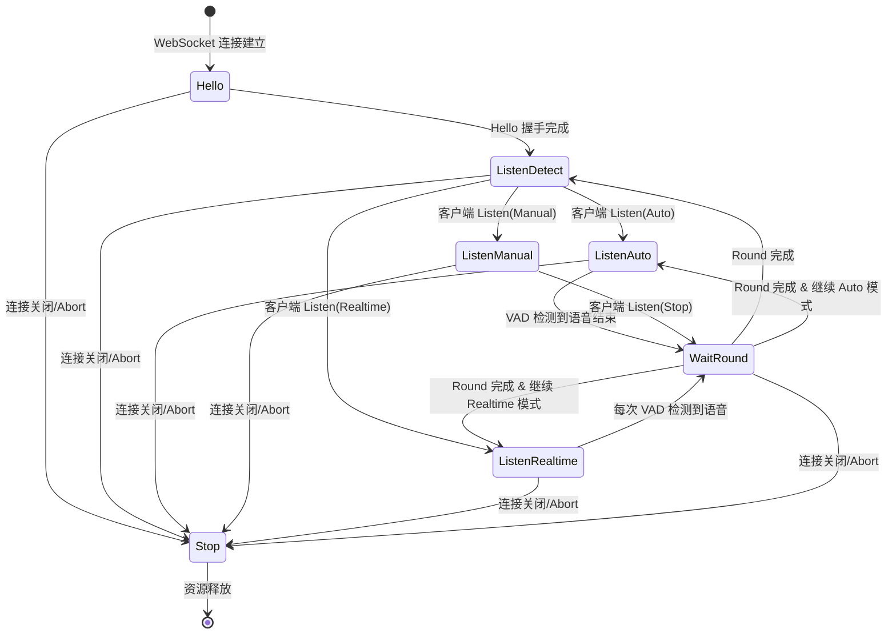
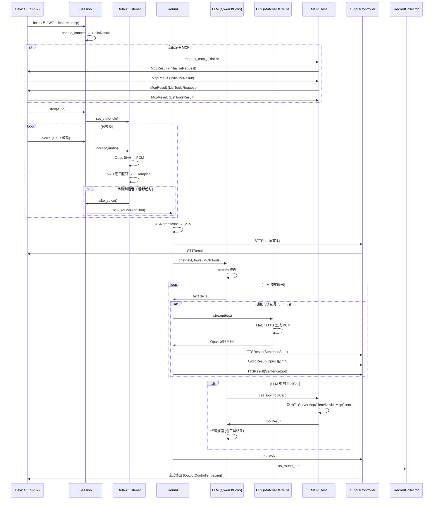
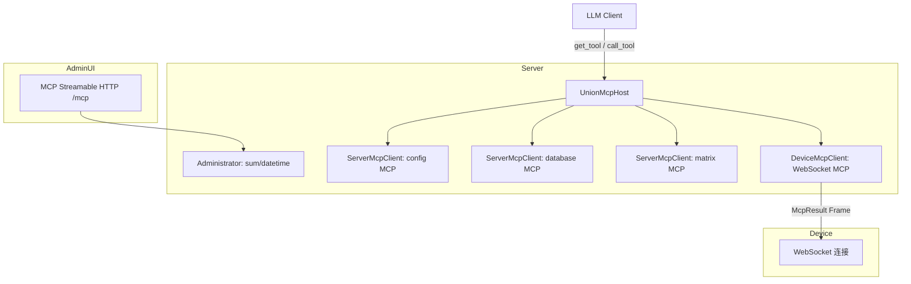
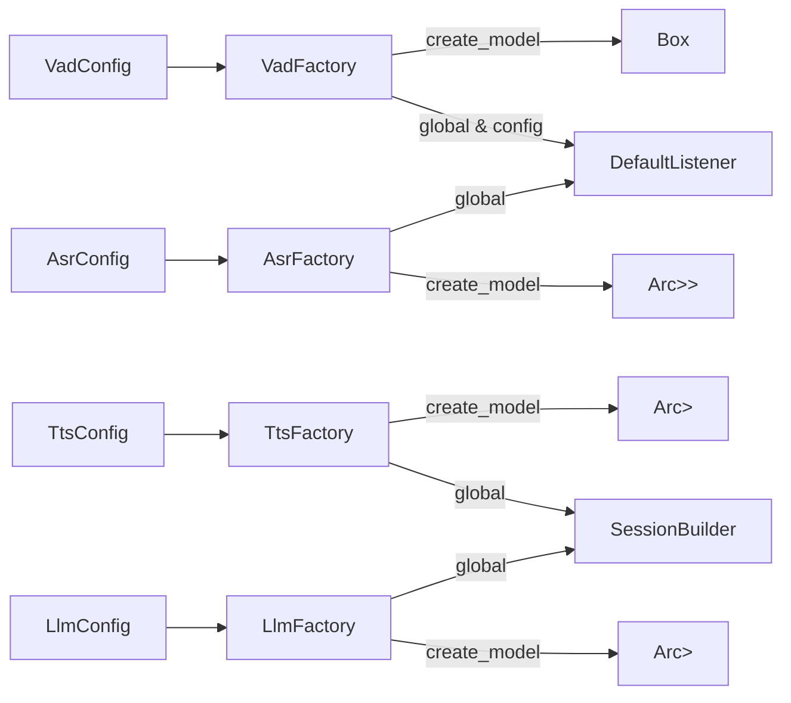
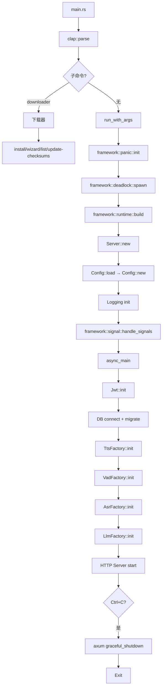
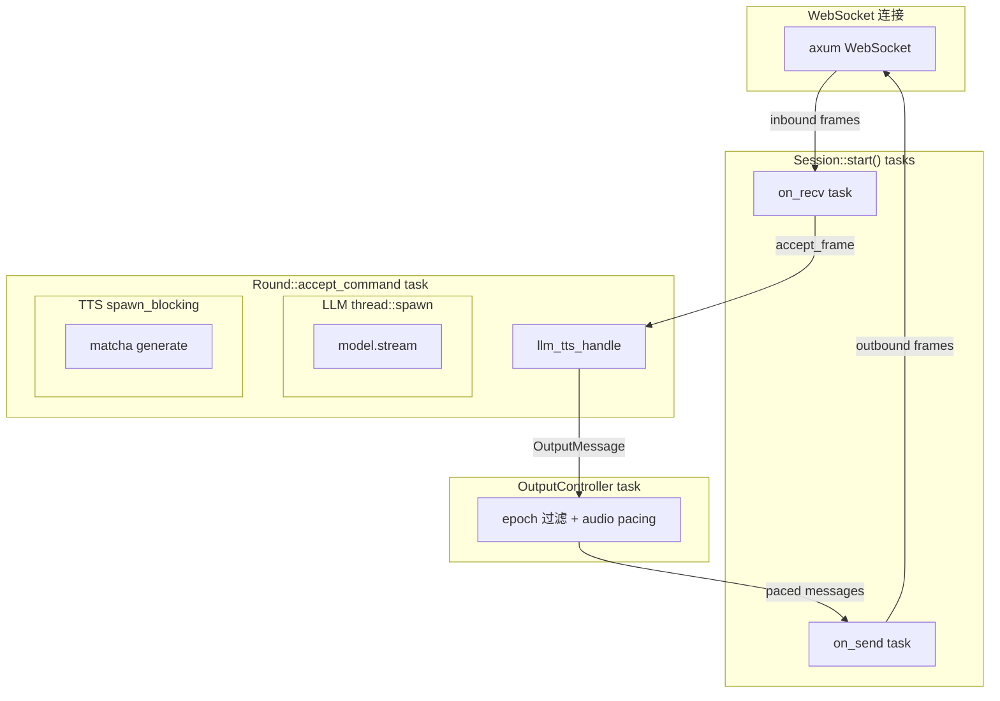

# Server 架构

## Session 生命周期

### 状态机 (Phase)

Session 通过 `Phase` 枚举管理连接生命周期：



### 三种 Listen 模式

| 模式 | 触发方式 | 结束条件 | 适用场景 |
|------|----------|----------|----------|
| Auto | 客户端发送 `Listen(Auto)` | VAD 检测到静默超时 | 语音唤醒后自动交互 |
| Manual | 客户端发送 `Listen(Manual)` | 客户端发送 `Listen(Stop)` | 按键对讲 |
| Realtime | 客户端发送 `Listen(Realtime)` | 每次 VAD 检测立即处理 | 实时转写 |

### 核心结构体

```
SessionBuilder (构建时注入所有依赖)
  └── Session
       ├── id: String (XID)
       ├── phase: Phase (状态机)
       ├── output_epoch: AtomicU64 (Round 递增计数器)
       ├── cancel: CancellationToken (整体取消)
       ├── round: Option<Round> (当前活跃 Round)
       ├── listener: Box<dyn Listener> (VAD + ASR + 音频缓冲)
       ├── output_controller: OutputController (出站流控)
       └── observers: Vec<Arc<dyn SessionObserver>> (持久化回调)
```

## 数据流

### 语音交互管线



### 三重中断机制

Round 中断通过三层协作实现：

1. **`Arc<AtomicBool>`** — `stop_round()` 设置 `stop=true`，`round.rs` 主循环检查
2. **`CancellationToken`** — `stop_round()` 调用 `cancel()`, 各子任务监听
3. **`output_epoch`** — `output_epoch` 递增，`OutputController` 过滤旧 epoch 消息

```rust
// session/mod.rs
pub async fn stop_round(&mut self) {
    self.round_stop.store(true, Ordering::Relaxed);
    if let Some(round) = &self.round {
        round.cancel.cancel();
    }
}

pub async fn new_round(&mut self, command: Command) {
    self.stop_round().await;
    let epoch = self.output_epoch.fetch_add(1, Ordering::Relaxed) + 1;
    let output_tx = self.output_controller.input_tx();
    let (round, rx) = Round::new(epoch, output_tx, ...);
    let join_handle = tokio::spawn(round.accept_command(command));
    // output 流切换到新的 Round 的 rx
}
```

## OutputController

`OutputController` 是出站消息的节流阀，位于 `Session` 和 WebSocket `on_send` 任务之间。

```
Round (unbounded_tx) → OutputController (bounded=64) → on_send task
```

职责：
- **epoch 过滤**：丢弃 `msg.epoch < current_epoch` 的过期消息
- **音频流控**：按 `frame_duration` 间隔精确 pacing Opus 音频包（`MissedTickBehavior::Skip`）
- **活跃时间更新**：每消息更新 `latest_activity_time` 用于连接超时检测

## DefaultListener

VAD 与音频缓冲区管理器，位于 `apps/server/api/src/ws/session/listener.rs`。

### 处理流程

```
Opus 音频包 → OpusDecoder.decode_float() → f32 PCM
  → 追加到 temp_voice_data
  → 每 256 samples 为一窗口：
      → 推入 prefix_buffer (ring buffer, max 4800 samples ≈ 300ms)
      → Vad.accept_waveform(&window) → score
      → if is_speech():
          state = Listening(true)
          if !prefix_flushed → flush prefix → voice_data
      → else: prefix_flushed = false
  → 超时检查 (silence_voice_timeout → End)
  → 连接超时检查 (close_connection_no_voice_time → 断开)
```

### 300ms 前缀缓冲

设计目的：补偿 VAD 检测延迟。Silero VAD 需要 80-256ms 才能稳定检测到语音。前缀缓冲确保 "语音开始" 之前的音频不被丢弃。

## Round 管道

`Round` 代表一轮完整的语音/文本交互（听 → 理解 → 生成 → 回复）。

### Command 枚举

```rust
pub enum Command {
    Chat { text: String },              // 纯文本对话
    AsrChat { text: String },           // ASR 结果触发的对话
    Wake { text: String },              // 唤醒词触发的对话
    ListenUnclear { text: String },     // VAD 检测但 ASR 结果不明确
}
```

### llm_tts_handle 管线

```mermaid
flowchart LR
    A[accept_command] --> B[发送 STTResult]
    B --> C[client.chat]
    C --> D{LLM stream}
    D -->|text delta| E[chat.accept_text → 句子分割]
    E --> F[发送 LLMResult]
    E -->|句子边界| G[tts.stream(text)]
    G --> H[TTS 生成 PCM]
    H --> I[Opus 编码]
    I --> J[AudioResult * N]
    D -->|ToolCall| K[mcp_host.call_tool]
    K --> L[ToolResult → history]
    L --> C
    D -->|Final| M[刷新剩余 buffer]
    M --> N[TTS Stop]
    N --> O[on_round_end]
```

## MCP 集成

### 架构



### DeviceMcpClient 状态机

```
Initialize → (发送 InitializeRequest)
  → GetToolList → (发送 ListToolsRequest, 分页)
    → ToolCall → (处理 LLM 发起的工具调用)
```

### 路由逻辑

`call_tool` 遍历所有 `ServerMcpClient` + `DeviceMcpClient`，构建运行时 `function_name → McpClient` 映射，优先匹配 server 端工具。

## 持久化 (Observer 模式)

### SessionObserver trait

位于 `apps/server/api/src/record/observer.rs`，定义 9 个回调钩子：

```rust
#[async_trait]
pub trait SessionObserver: Send + Sync {
    async fn on_session_start(&self, ctx: &SessionContext);
    async fn on_session_end(&self, ctx: &SessionContext);
    async fn on_round_start(&self, ctx: &RoundStartContext);
    async fn on_asr(&self, ctx: &AsrContext);          // voice_pcm + 文本 + 置信度
    async fn on_text_input(&self, ctx: &TextInputContext);
    async fn on_llm_delta(&self, ctx: &LlmDeltaContext);
    async fn on_tts_delta(&self, ctx: &TtsDeltaContext); // raw_pcm 可用于回放
    async fn on_frame(&self, ctx: &FrameContext);        // 每帧消息记录
    async fn on_round_end(&self, ctx: &RoundEndContext); // Completed/Interrupted
}
```

### RecordCollector

唯一实现者，使用 `RoundBuffer` 在内存中缓存一轮的所有步骤数据，`round_end` 时通过异步 `write_worker` 批量写入 DB。

DB 表结构：
- `session` — 会话记录 (id + 时间戳)
- `round` — 轮次记录 (session_id, mode, client_info, status)
- `round_data` — 步骤数据 (round_id, data_type, blob, text, metadata)
- `frame` — 消息帧序列 (round_id, seq, dir, kind, detail, elapsed_us)

## 认证与授权

### 双 Token JWT

```
access_token: HS256, 8h 有效期 (configurable)
refresh_token: HS256, 184d 有效期 (configurable)
```

- `sub` 格式: `{user_id}:{user_name}`
- 通过 `Authorization: Bearer <token>` 传递
- WebSocket 连接时通过 HTTP headers 传递 JWT

### API 端点

| 路径 | 方法 | 认证 | 说明 |
|------|------|------|------|
| `/auth/login` | POST | 无 | 账号密码登录 |
| `/auth/access_token` | POST | 无 | Refresh token 换取新 access token |
| `/auth/reset_password` | POST | 需要 | 修改密码 |
| `/auth/user` | GET | 需要 | 获取当前用户信息 |

## 错误处理体系

### 错误码范围

| 范围 | 分类 | 枚举 | 位置 |
|------|------|------|------|
| 101xxx | 基础 | `BaseErrorCode` | `libs/framework/src/error/base_code.rs` |
| 201xxx | 第三方 | `ThirdPartyErrorCode` | `libs/framework/src/error/third_party_code.rs` |
| 301xxx | 框架 | `FrameworkErrorCode` | `libs/framework/src/error/framework_code.rs` |
| 401xxx | 严重 | `CriticalErrorCode` | `libs/framework/src/error/critical_code.rs` |
| 402xxx | 认证 | `AuthErrorCode` | `libs/framework/src/error/auth_code.rs` |
| 501xxx | 用户业务 | `UserErrorCode` | `apps/server/api/src/auth.rs` |
| 502xxx | OTA | `OtaErrorCode` | `apps/server/api/src/ota.rs` |
| 503xxx | AI 模型 | `ModelErrorCode` | `apps/server/api/src/common/mod.rs` |
| 504xxx | WebSocket | `WsErrorCode` | `apps/server/api/src/ws/mod.rs` |

### 错误传播路径

```
ModelError (thiserror) ──→ AppError (err! macro) ──→ IntoResponse (HTTP JSON)
                                                ──→ WsErrorFrame (WebSocket JSON)
```

## 工厂模式

所有 AI 组件通过 OnceLock 全局 Factory 管理：



初始化顺序 (在 `api::start` 中)：
1. `Jwt::init(auth_config)` — JWT
2. 数据库连接 + 迁移
3. `TtsFactory::init(tts_config, audio_config)`
4. `VadFactory::init(vad_config)`
5. `AsrFactory::init(asr_config)`
6. `LlmFactory::init(llm_config)`
7. HTTP 服务启动 (+ 可选 Matrix 客户端)

## 配置系统

### 加载链

```
TOML 文件 (--config) → CHOBITS_ 环境变量 → CLI -O key=value 覆盖
  → Figment merge → serde deserialize → Config → check() 校验
```

### 模型地址推导

```
derive_tts_path(manifest_base, variant)
  → "data/tts/model/matcha/matcha-icefall-zh-en/"
derive_asr_path(manifest_base, variant)
  → "data/asr/model/sense_voice/default/"
derive_llm_path()
  → "data/llm/model/qwen3/0.6b/"
```

### 模型枚举

| 配置键 | 枚举值 | 默认 |
|--------|--------|------|
| `vad_model` | `void`, `earshot` | `earshot` |
| `tts_model` | `mute`, `matchatts` | `matchatts` |
| `asr_model` | `void`, `sensevoice` | `sensevoice` |
| `llm_model` | `echo`, `qwen3` | `qwen3` |

## 启动流程



## 构建系统

### Monorepo

使用 Moon (moonrepo) 管理：

- `.moon/workspace.yml` — 项目定义 (`apps/*`, `libs/*`, `docs`)
- `.moon/toolchains.yml` — pnpm, TypeScript 同步
- `apps/server/moon.yml` — 14 个任务 (check/build/lint/test/run/dev/bump/downloader)
- `apps/server-ui/moon.yml` — 4 个任务 (build/test/typecheck/dev)

### Nix Flake

开发环境由 flake.nix 管理，提供三个 devShell：

| Shell | 包含 | 命令 |
|-------|------|------|
| `default` | rust + node + pnpm + moon + mdbook + cmake + protobuf + flutter | `nix develop` |
| `#server` | 仅 Rust 工具链 | `nix develop .#server` |
| `#frontend` | 仅前端工具 | `nix develop .#frontend` |

### Rust 工具链

```toml
# rust-toolchain.toml
channel = "1.95.0"  # Edition 2024
components = ["rustfmt", "clippy", "rust-src", "rust-analyzer"]
```

## 并发模型



关键设计决策：
- `on_recv` 和 `on_send` 使用 `tokio::spawn`（IO 密集）
- LLM 推理使用 `thread::spawn` + `block_on`（CPU 密集，不阻塞 tokio runtime）
- TTS 生成使用 `tokio::task::spawn_blocking`（ONNX 推理阻塞）
- Round 间通过 `output_epoch` 隔离，旧 Round 消息自动丢弃
- OutputController 作为唯一节流点，使用 `bounded(64)` channel 反压
