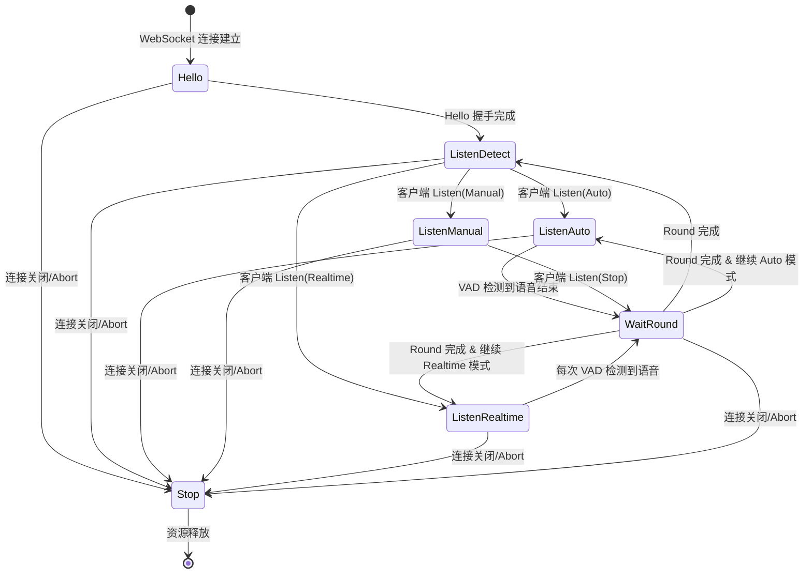
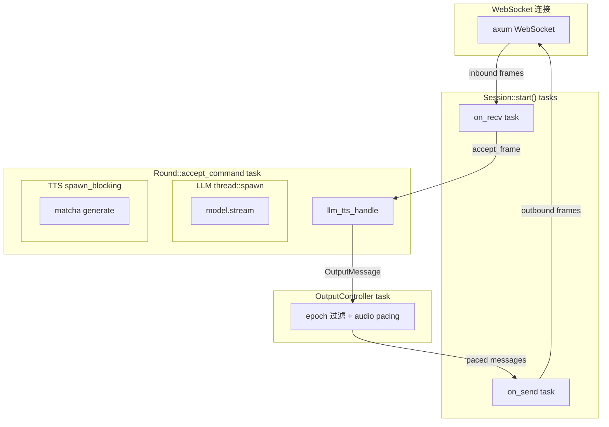
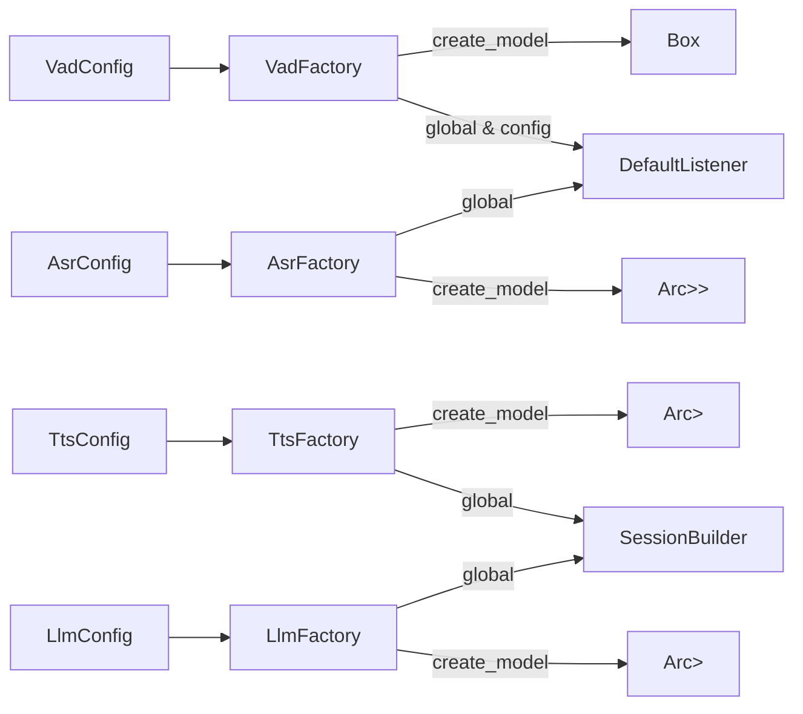

# 核心架构

## 会话生命周期

### 状态机 (Phase)

Session 通过 `Phase` 枚举管理连接生命周期：



### 三种监听模式

| 模式 | 触发方式 | 结束条件 | 适用场景 |
|------|----------|----------|----------|
| Auto | 客户端发送 `Listen(Auto)` | VAD 检测到静默超时 | 语音唤醒后自动交互 |
| Manual | 客户端发送 `Listen(Manual)` | 客户端发送 `Listen(Stop)` | 按键对讲 |
| Realtime | 客户端发送 `Listen(Realtime)` | 每次 VAD 检测立即处理 | 实时转写 |

### 核心结构体

```
SessionBuilder (构建时注入所有依赖)
  └── Session
       ├── id: String (XID)
       ├── phase: Phase (状态机)
       ├── output_epoch: AtomicU64 (Round 递增计数器)
       ├── cancel: CancellationToken (整体取消)
       ├── round: Option<Round> (当前活跃 Round)
       ├── listener: Box<dyn Listener> (VAD + ASR + 音频缓冲)
       ├── output_controller: OutputController (出站流控)
       └── observers: Vec<Arc<dyn SessionObserver>> (持久化回调)
```

## 并发模型



关键设计决策：
- `on_recv` 和 `on_send` 使用 `tokio::spawn`（IO 密集）
- LLM 推理使用 `thread::spawn` + `block_on`（CPU 密集，不阻塞 tokio runtime）
- TTS 生成使用 `tokio::task::spawn_blocking`（ONNX 推理阻塞）
- Round 间通过 `output_epoch` 隔离，旧 Round 消息自动丢弃
- OutputController 作为唯一节流点，使用 `bounded(64)` channel 反压

## 工厂模式

所有 AI 组件通过 OnceLock 全局 Factory 管理：



初始化顺序 (在 `api::start` 中)：
1. `Jwt::init(auth_config)` — JWT
2. 数据库连接 + 迁移
3. `TtsFactory::init(tts_config, audio_config)`
4. `VadFactory::init(vad_config)`
5. `AsrFactory::init(asr_config)`
6. `LlmFactory::init(llm_config)`
7. HTTP 服务启动 (+ 可选 Matrix 客户端)
