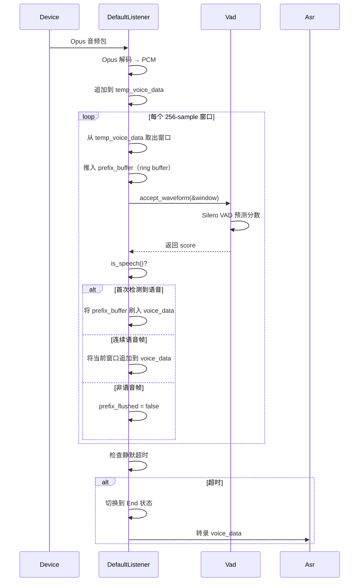

# VAD & Listener

## 架构概述

语音活动检测（VAD）和音频监听器（Listener）是语音交互管线的起点。两者分工明确：

- **VAD**：纯决策引擎，只回答"当前帧是否有语音"，不管理任何音频缓冲区
- **Listener**：音频管道管理器，负责 Opus 解码、VAD 窗口循环、音频积累和状态管理

```
apps/server/api/src/
├── vad/                         # VAD 模块
│   ├── mod.rs                   # Vad trait、VadFactory
│   └── model/
│       ├── earshot/mod.rs       # VadEarshot (Silero VAD)
│       └── void/mod.rs          # VadVoid (no-op)
└── ws/session/
    └── listener.rs              # Listener trait、DefaultListener
```

### 处理流程



## VAD 模块

### Vad trait

定义在 `apps/server/api/src/vad/mod.rs`：

```rust
#[async_trait]
pub trait Vad: Send + Sync {
    async fn accept_waveform(&mut self, samples: &[f32]) -> Result<f32, ModelError>;
    async fn is_speech(&mut self) -> bool;
    async fn clear(&mut self);
    async fn window_size(&self) -> usize;
}
```

| 方法 | 说明 |
|------|------|
| `accept_waveform` | 送入一帧 PCM 数据，返回语音分数 [0, 1]，VAD 内部维护状态机 |
| `is_speech` | 根据内部状态（分数、持续静默时间等）判断当前是否处于语音状态 |
| `clear` | 重置 VAD 内部状态，用于一轮对话结束后清理 |
| `window_size` | 期望的输入帧大小（单位：sample） |

**设计原则**：VAD 只做决策，不存储音频样本。旧版设计中 VAD 内部持有 `samples`、`front()`、`pop()` 等音频缓冲区方法，新版将其全部移除，音频累积统一由 Listener 管理。

### 模型实现

| 模型 | 配置名 | 窗口大小 | 说明 |
|------|--------|---------|------|
| **VadEarshot** | `earshot` | 256 samples (16ms) | 基于 Silero VAD，权重嵌入二进制，无外部依赖 |
| **VadVoid** | `void` | 512 samples | 固定返回 `is_speech() = true`，用于测试 |

#### VadEarshot

底层使用 [earshot](https://crates.io/crates/earshot) 库，内嵌 Silero VAD 模型权重（`include_bytes!`），机器学习特征计算完全在纯 Rust 中完成，无需 ONNX 运行时。

噪声门逻辑：

```rust
// 从非语音切换到语音需要连续 5 帧分数 >= threshold
if !self.is_speech {
    if score >= threshold {
        self.prediction_list.push(score);
    } else {
        self.clear();              // 任何一帧低于阈值就重置
    }
    if self.prediction_list.len() >= 5 {
        self.is_speech = true;
    }
}

// 语音状态下累积静默时间，超过 min_silence_duration 后切回非语音
if score >= threshold {
    self.current_silence_duration = 0.0;
} else {
    self.current_silence_duration += frame_duration_ms;
    if self.current_silence_duration > self.min_silence_duration {
        self.clear();
    }
}
```

#### VadVoid

固定返回 `is_speech() = true`、`accept_waveform` 返回分数 1.0。用于集成测试中跳过 VAD 决策，直接验证 Listener 和 ASR 管道。

### 配置

```rust
#[derive(Debug, Deserialize, Clone)]
pub struct VadConfig {
    pub model: Option<VadModel>,            // earshot / void
    pub variant: Option<String>,
    pub path: Option<String>,
    pub num_threads: Option<i32>,
    pub threshold: Option<f32>,             // 语音阈值，默认 0.5
    pub min_silence_duration: Option<f32>,  // 静默判定超时（ms），默认 1000
}
```

```toml
# application.toml（由 flake 环境变量自动注入）
vad_model = "earshot"
vad_threshold = 0.5
vad_min_silence_duration = 1000.0
```

| 字段 | 默认值 | 说明 |
|------|--------|------|
| `threshold` | `0.5` | VAD 语音判定阈值，越低越敏感。阈值扫描结果见[测试](#测试策略) |
| `min_silence_duration` | `1000` | 语音结束判定：连续静默超过此值（ms）才认为语音结束 |

### Factory 模式

```rust
// 初始化
VadFactory::init(&config).await;

// 使用
let vad = VadFactory::global().default();  // Arc<Mutex<Box<dyn Vad>>>
vad.lock().await.accept_waveform(&samples).await?;
```

## Listener 模块

### Listener trait

定义在 `apps/server/api/src/ws/session/listener.rs`：

```rust
#[async_trait]
pub trait Listener: Send + Sync {
    async fn listen(&mut self, data: &[u8]);                                 // 处理 Opus 包
    fn set_state(&mut self, state: ListenState);
    fn get_state(&self) -> ListenState;
    async fn get_result(&mut self) -> Result<ListenResult, ModelError>;      // ASR 转录
    async fn reset(&mut self, silence_voice_timeout: Option<i64>);
    async fn set_sender(&mut self, tx: Sender<Result<FrameResult, AppError>>);
    async fn get_voice_data(&self) -> Vec<f32>;                              // 调试/测试用
}
```

### 状态机

```
Idle ──(首次 listen())──▶ Listening(false)
                             │
                   (VAD 检测到语音)
                             ▼
                        Listening(true)
                             │
                   (静默超时到达)
                             ▼
                           End
                             │
                       (reset())
                             ▼
                           Idle
```

| 状态 | 说明 |
|------|------|
| `Idle` | 初始状态，等待第一帧音频 |
| `Listening(false)` | 正在接收音频，VAD 尚未确认语音 |
| `Listening(true)` | 正在接收音频，已检测到语音 |
| `End` | 静默超时，会话结束，准备转录 |

### DefaultListener

#### 数据结构

```rust
pub struct DefaultListener {
    temp_voice_data: Arc<Mutex<Vec<f32>>>,   // Opus 解码后的 PCM 暂存区
    voice_data: Arc<Mutex<Vec<f32>>>,        // 累积的语音 PCM（最终送 ASR）
    vad: Arc<Mutex<Box<dyn Vad>>>,
    asr: Arc<Mutex<Box<dyn Asr>>>,
    decoder: Arc<Mutex<opus_rs::OpusDecoder>>,
    state: ListenState,
    silence_voice_timeout: Option<i64>,       // 单位 ms
    latest_speaking_time: Option<i64>,
    audio_config: Arc<AudioConfig>,

    // 前缀缓冲（300ms ring buffer）
    prefix_buffer: Vec<f32>,                  // 最大 4800 samples
    prefix_flushed: bool,                     // 当前轮次是否已刷入
}
```

#### listen() 循环

```
Opus 包
  │
  ▼
OpusDecoder.decode() → PCM f32
  │
  ▼
追加到 temp_voice_data
  │
  ▼
while temp_voice_data.len() > window_size:
  │
  ├─ drain 256 samples → window
  ├─ prefix_buffer.extend(&window)
  ├─ trim prefix_buffer to ≤4800
  ├─ VAD.accept_waveform(&window)
  │
  └─ if VAD.is_speech():
  │      state = Listening(true)
  │      if !prefix_flushed:
  │          voice_data += prefix_buffer (300ms 前缀)
  │          prefix_flushed = true
  │      else:
  │          voice_data += window (仅当前帧)
  │   else:
  │      prefix_flushed = false
  │
  ▼
检查静默超时
```

#### 前缀缓冲设计

**目的**：VAD 不能零延迟检测语音起始。当 VAD 报告 `is_speech = true` 时，说话人实际已经开始发声 ~5-16 帧（80-256ms）。如果没有前缀缓冲，voice_data 会丢失语音起始部分。

**实现**：

- 大小：`PREFIX_SAMPLES_MAX = 4800`（300ms × 16000Hz）
- 机制：每个 VAD 窗口都追加到 `prefix_buffer`，超出部分从头部裁剪（ring buffer）
- 首次 `is_speech()` 时，整个 `prefix_buffer` 被移到 `voice_data` 作为前缀
- 后续连续语音帧只追加当前窗口，不重复刷前缀
- 非语音帧重置 `prefix_flushed = false`，保证下一轮语音有新的前缀
- `reset()` 时清空前缀缓冲和标志位

#### 静默超时

```rust
if let (Some(timeout), Some(last_speech)) = (self.silence_voice_timeout, self.latest_speaking_time) {
    let elapsed = Local::now().timestamp_millis() - last_speech;
    if elapsed >= timeout {
        self.state = ListenState::End;
    }
}
```

- `latest_speaking_time` 在每个 `is_speech()` 帧更新
- 静默超时到达后 state 变为 `End`，由 Session 触发 ASR 转录

## 测试策略

### VAD 层测试

`tests/vad_test.rs` — 功能验证：

- 语音 → 沉默 → 语音 三轮状态切换
- 验证 `is_speech()` 正确跟随音频内容变化

`tests/vad_analysis_test.rs` — 精度评估（`#[ignore]`，需 TEN-vad 测试集）：

```
=== Summary (threshold=0.5) ===
frames   correct  TP       FP       TN       FN       Precision    Recall       F1
4418     3815     3218     508      597      95       0.8637       0.9713       0.9143
```

| 阈值 | 精确率 | 召回率 | F1 |
|------|--------|--------|----|
| 0.50 | 0.864 | **0.971** | 0.914 |
| 0.70 | **0.930** | 0.925 | **0.928** |

当前默认阈值 `0.50` 偏向召回率（减少漏切语音），适合"不要切断说话"的生产需求。

### Listener 层测试

`tests/listener_test.rs` — 5 个白盒测试：

| 测试 | 场景 |
|------|------|
| `test_prefix_included_in_first_speech` | 静默 2s → 语音，验证 voice_data ≥ 4800 |
| `test_voice_data_grows_monotonically` | 两轮连续语音，数据只增不减 |
| `test_prefix_fresh_after_silence` | 轮次间 3s 静默后前缀重新填充 |
| `test_reset_clears_everything` | Reset 后 voice_data 为空，再填充有新的前缀 |
| `test_silence_only_no_end_state` | 纯静音未设超时，永不进入 End |

### 集成测试

`tests/session_test.rs` — 完整管道集成测试（`#[ignore]`，需真实模型文件）：
- `test_chat_flow_hello`：Void VAD + Void ASR + Echo LLM + Mute TTS
- `test_chat_flow_listen_manual`：Opus 编码/解码 + VAD + Void ASR
