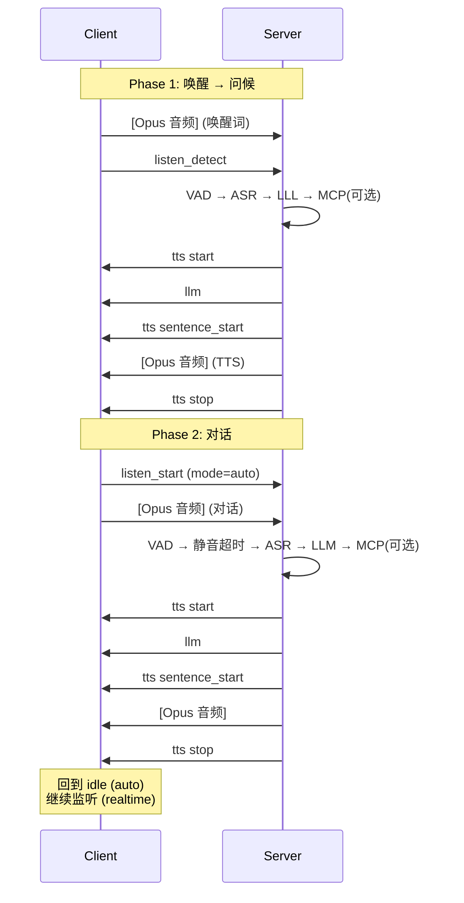
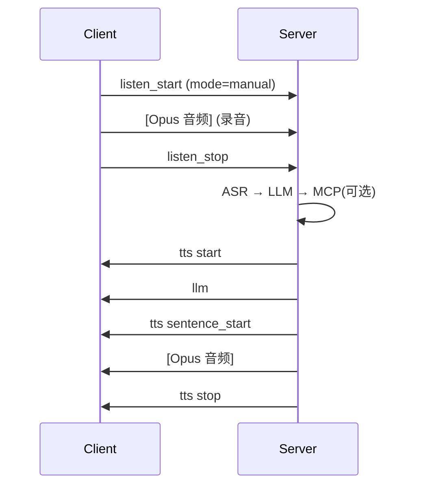
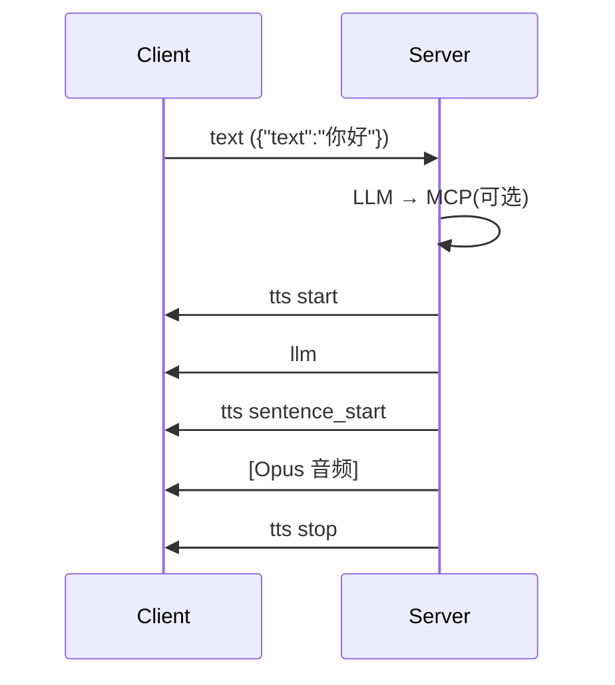
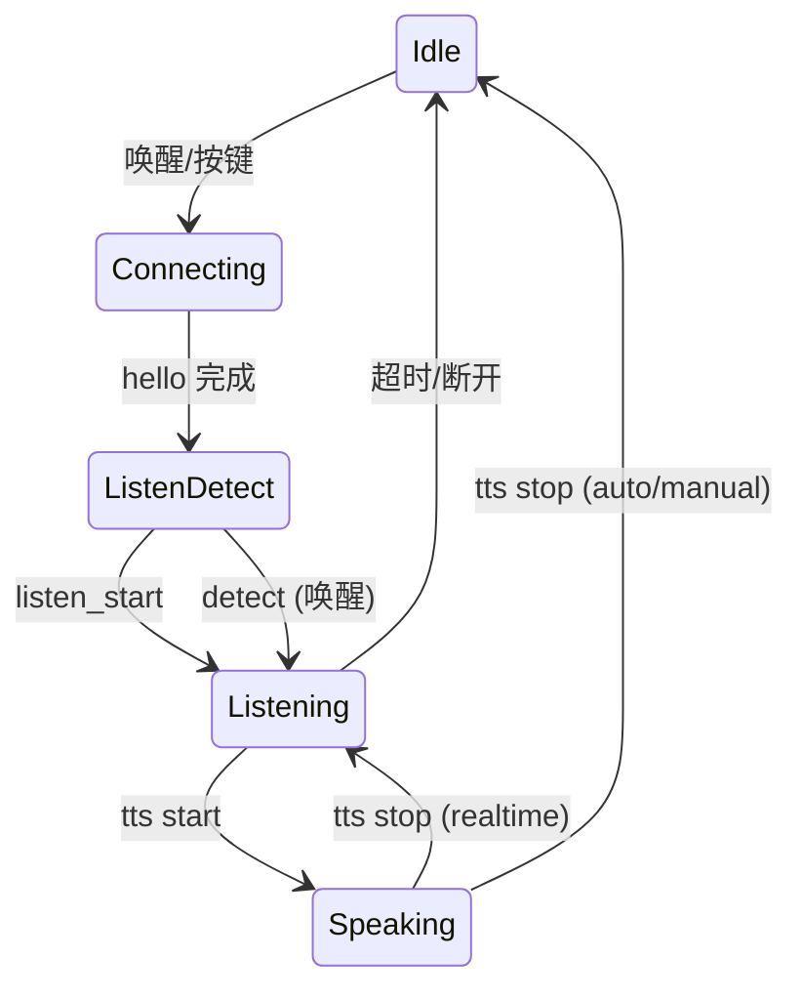

# WebSocket 通信协议

本协议基于 [xiaozhi-esp32](https://github.com/78/xiaozhi-esp32) 与 chobits 服务端的实际实现整理。

---

## 1. Protocol Overview

```
connect
  request
    hello
  response
    hello

listen
  Auto / Realtime
    request
      [audio]                                // 唤醒词音频
      detect-text                            // {"text":"Hi XiaoZhi"}
      <vad>
        //asr
        //llm
          <mcp>
    response
      <tts>                                  // 问候

    request
      listen_start                           // {"mode":"auto"}
      [audio]                                // 对话音频
        <vad>
        //asr
        //llm
          <mcp>
    response
      <tts>                                  // auto: 播放后回到 idle
                                             // realtime: 播放后继续监听

  Manual
    request
      listen_start                           // {"mode":"manual"}
      [audio]                                // 录音
        //asr
        //llm
          <mcp>
      listen_stop
    response
      <tts>

  Text
    request
      text                                   // {"text":"你好"}
        //llm
          <mcp>
    response
      <tts>

abort                                        // 打断 TTS
  request
    abort

---

vad                                          // 服务端内部
  vad pass
    //silent checking stop
    //to asr
  vad ignore
    abort

tts                                          // 服务端 → 客户端
  response
    start
      llm                                    // {"emotion":"happy"}
      sentence_start
      [audio]
      sentence_end
    stop

mcp                                          // tools/call
  request
    tool_call
  response
    tool_result
```

---

## 2. 连接建立

### 2.1 WebSocket Headers

| Header | 必选 | 说明 |
|--------|------|------|
| `Authorization` | 否 | `Bearer <token>` |
| `Protocol-Version` | 是 | 二进制协议版本，目前为 `1` |
| `Device-Id` | 是 | MAC 地址 |
| `Client-Id` | 是 | UUID v4 |

### 2.2 Hello

客户端 → 服务端：

```json
{
  "type": "hello",
  "version": 1,
  "transport": "websocket",
  "audio_params": {
    "format": "opus",
    "sample_rate": 16000,
    "channels": 1,
    "frame_duration": 60
  },
  "features": {
    "mcp": true,
    "aec": true
  }
}
```

服务端 → 客户端：

```json
{
  "type": "hello",
  "transport": "websocket",
  "session_id": "xxx",
  "audio_params": {
    "sample_rate": 24000,
    "frame_duration": 60
  }
}
```

`transport` 为**必选**，缺失或不匹配 `"websocket"` 时客户端会断开连接。`session_id` 为会话标识，后续所有消息中携带。`audio_params` 方向独立：客户端 Hello 表示上行参数（设备→服务端），服务端 Hello 表示下行参数（服务端→设备）。

---

## 3. 会话时序

### Auto 模式



### Manual 模式



### 文本模式



### 状态机



---

## 附录 A：消息字段参考

A.1 客户端 → 服务端

```
type:hello
  version: int              必选
  transport: "websocket"    必选
  audio_params: {}
    format: "opus"
    sample_rate: 16000
    channels: 1
    frame_duration: 60      单位 ms
  features: {}
    mcp: bool
    aec: bool

type:listen, state:detect
  session_id: string        必选
  text: string              唤醒词原文，如 "Hi XiaoZhi"

type:listen, state:start
  session_id: string        必选
  mode: "auto"|"manual"     必选

type:listen, state:stop
  session_id: string        必选

type:text
  session_id: string        必选
  text: string              必选，用户输入文本

type:abort
  session_id: string        必选
  reason: string            可选，"wake_word_detected"
```

A.2 服务端 → 客户端

```
type:hello
  transport: "websocket"    必选
  session_id: string        必选
  audio_params: {}
    sample_rate: int        可选，默认 24000
    frame_duration: int     可选，默认 60

type:stt
  session_id: string
  text: string              ASR 识别结果

type:llm
  session_id: string
  emotion: string           "happy"|"sad"|"neutral"|...
  text: string              表情符号

type:tts, state:start
  session_id: string

type:tts, state:sentence_start
  session_id: string
  text: string              当前句子文本

type:tts, state:sentence_end
  session_id: string

type:tts, state:stop
  session_id: string

type:system
  command: "reboot"

type:mcp
  payload: {}               JSON-RPC 2.0
```

---

## 附录 B：二进制协议

Opus 编码音频通过 WebSocket 二进制帧传输。版本号由 `Protocol-Version` Header 声明。

### 版本 1（默认）

裸 Opus 数据，无头部。

```
[Opus 数据]
```

### 版本 2

16 字节头部 + Opus 数据（所有多字节字段使用网络字节序）。

```
struct BinaryProtocol2 {
    uint16_t version;        // 协议版本
    uint16_t type;           // 0=OPUS, 1=JSON
    uint32_t reserved;
    uint32_t timestamp;      // 时间戳(ms)，用于服务端 AEC
    uint32_t payload_size;
    uint8_t  payload[];
};
```

### 版本 3

4 字节头部 + Opus 数据。

```
struct BinaryProtocol3 {
    uint8_t  type;           // 0=OPUS
    uint8_t  reserved;
    uint16_t payload_size;
    uint8_t  payload[];
};
```

---

## 附录 C：变更

| 日期 | 说明 |
|------|------|
| 2026-06 | 重新整理。概览/时序/字段参考分层。新增 `type:text`，去掉 `realtime` 独立模式，`detect` 仅用于唤醒 |
